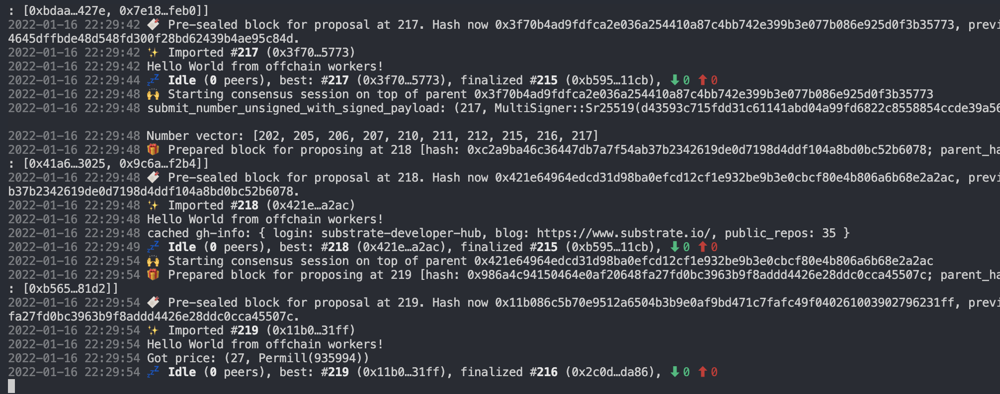
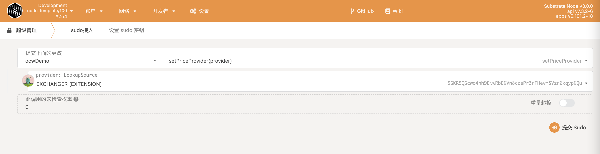
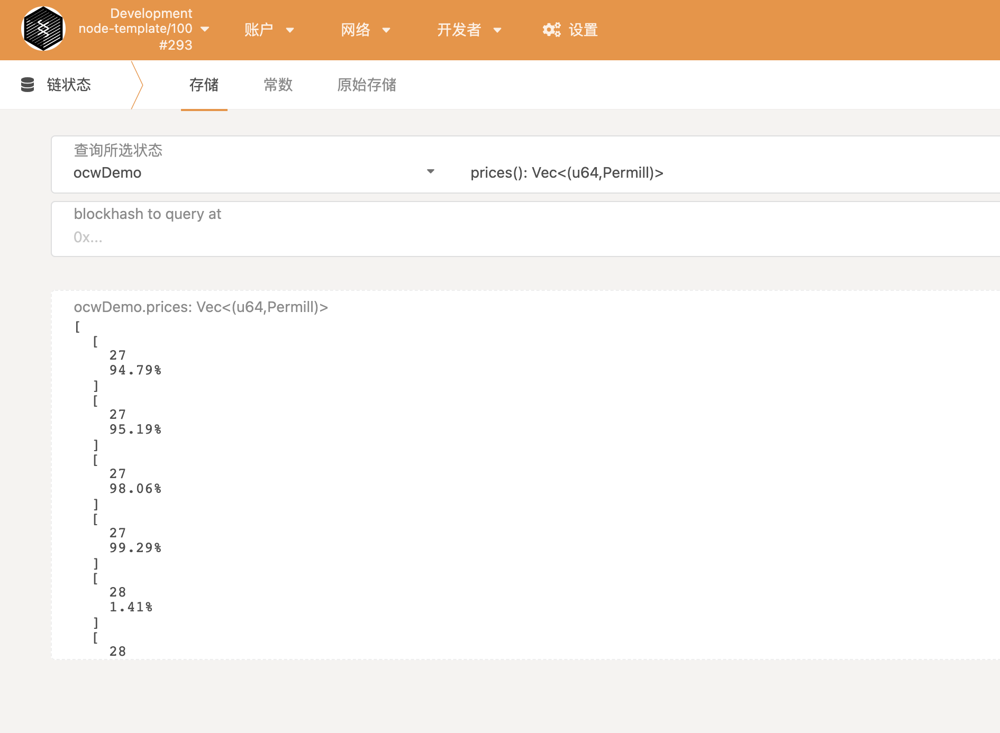

# OCW Demo

## 构建和运行

```sh
cargo build --release

cargo run --release -- --dev --tmp
```



## 通过sudo设置价格提供者



## 通过RPC插入价格提供者的密钥对

```sh
curl http://127.0.0.1:9933 -H "Content-Type:application/json;charset=utf-8" -X POST --data '{"jsonrpc":"2.0","id":1,"method":"author_insertKey","params": ["demo", sr25519账户公钥hex, sr25519账户私钥hex]}'
```

## 链运行一段时间后，就会把DOT价格上链

